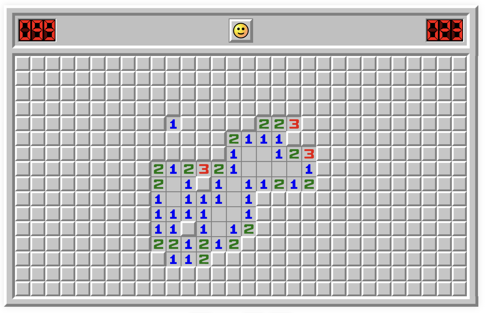
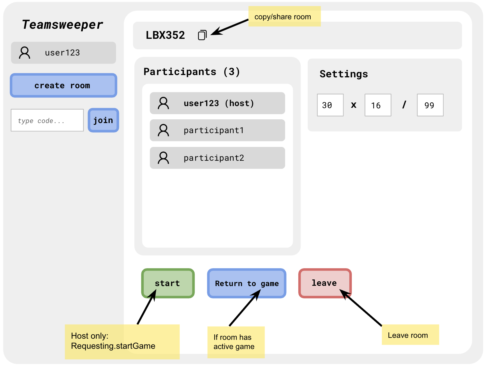
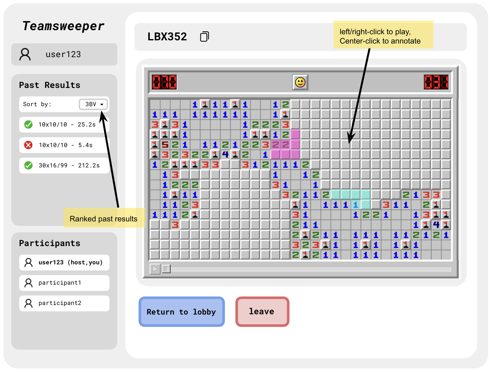
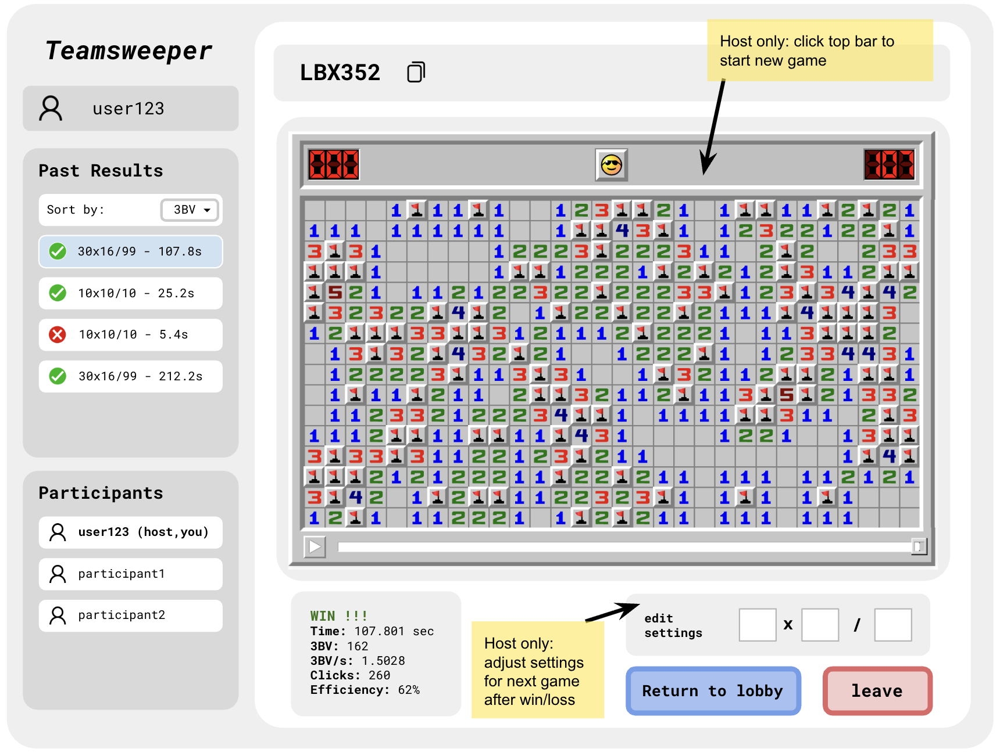
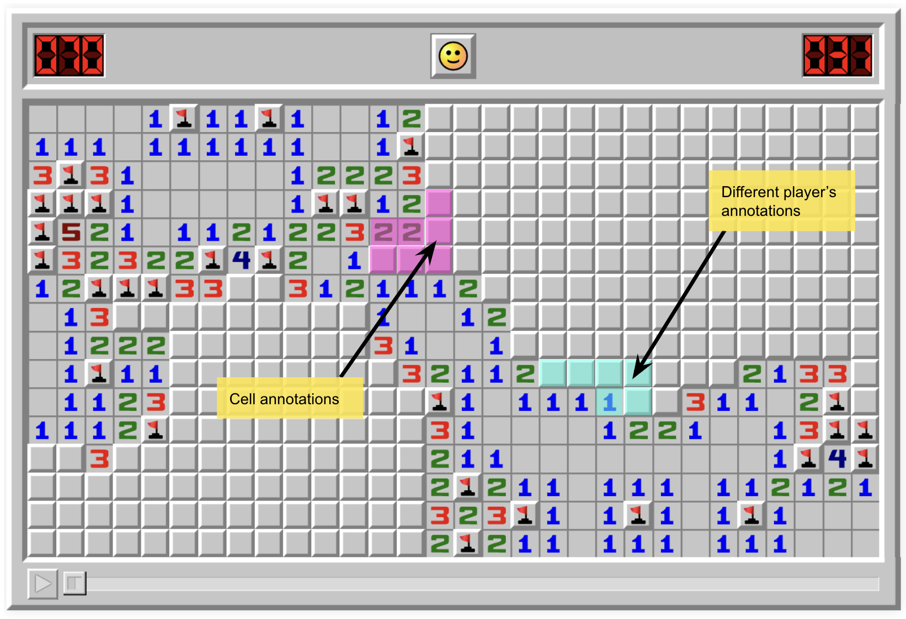

# Personal Project 1: Design

## Problem Framing

### Domain

Minesweeper is a single-player puzzle played on a grid of hidden cells, some of which contain mines. Clicking to reveal a "safe" cell—one that does not contain a mine—displays the number of mines among its up to eight adjacent cells, which allows the player to deduce which other cells are safe. To win, the player must reveal every safe cell without revealing a single mine, which ends the game immediately.

  
   
  <em>A partially solved Minesweeper board.</em>

Despite its single-player format, Minesweeper has a rich competitive online community. A major platform for the game is [minesweeper.online](https://minesweeper.online/), where players solve boards online and compare their performance through statistics. Common measurements include completion time, efficiency, and 3BV, which represents the minimum number of clicks needed to solve a particular board. These statistics allow community members to compare results and learn from stronger performances.

More recently, the game has expanded into real-time multiplayer play. Minesweeper.online offers a PvP mode in which participants race to complete separate copies of the same board side-by-side. This allows players to compete directly, but their actions remain independent and do not contribute to a shared solution. As a result, the multiplayer experience is less collaborative than the broader community, whose members regularly share strategies and learn from one another.

### Bad Situations

Existing multiplayer formats make other players’ progress visible without making their reasoning accessible. This creates several bad situations for players who want Minesweeper to function as a shared activity, rather than only as a competition:

1. **Limited group activity.** There are four friends who each like to play Minesweeper, and they want to solve a puzzle together on Minesweeper.online. Because the available PvP mode supports only two players per match, they must divide into pairs and play separate games. Even so, the matched players have little opportunity to discuss the puzzle because both players are focused on completing their own boards. The friends are divided across matches, and cannot participate in one genuinely shared activity.

2. **Getting stuck.** A player encounters a board position they do not know how to solve, and they ask for help from a more experienced friend. When they use a conventional single-player board, asking for help involves a considerable amount of friction: the player may need to send a screenshot or share their screen, and the friend still has no way to interact with the board directly to explain the solution and help the player move forward.

3. **Differences in skill.** Two friends of different Minesweeper experience levels want to play together, so they enter a PvP race. The experienced player recognizes patterns and completes their board quickly, while the newer player falls behind as they work independently. Repeated matches may therefore become predictable and discouraging rather than enjoyable, providing little opportunity to learn together.

### Corroboration

In researching existing multiplayer Minesweeper games and community discussions, I found evidence that some players want to move beyond the game’s traditionally solitary format. For example, Yermak[^1], a highly active and experienced player, proposes in his Minesweeper.online profile a cooperative mode in which two or more players solve the same board and share the reward. Although this represents only one player’s suggestion, I believe his extensive activity on the platform makes his perspective particularly informed, and provides direct evidence that at least one established community member wants a collaborative alternative to the current PvP mode.

Additionally, I found relevant discussion surrounding an independent live multiplayer Minesweeper game—MinesweeperPro—posted on Y Combinator's Hacker News[^2], which further suggested the desire for more collaborative features. User Paturages shared that the app's point system “steers the game towards competitiveness rather than cooperation,” which others echoed in their comments. Others described having few opportunities to contribute when faster players cleared the board first, and some requested private rooms for playing with friends. These experiences mirror my bad situations on differences in skill and limited group activity, leading me to believe that a shared board alone does not create genuine collaboration; players want to share a common goal, rather than compete for individual rewards.

Finally, I found a Steam statistics page[^3] for another independent game, Minesweeper Together, which supports both cooperative and versus play and suggests preference for a cooperative game mode. The page shows that 64.1% of players have earned the “Winning Together” achievement for winning a shared game, while 16.3% have earned the “On Top” achievement for winning a versus game. Although these percentages may not perfectly represent the broader Minesweeper community, the difference suggests that Minesweeper players may generally be more interested in collaborative multiplayer experiences than competitive ones.

My research has a couple limitations. For one, I did not find widespread complaints about Minesweeper.online’s current PvP mode, so I cannot conclude that the larger community is dissatisfied with it. 
Yermak’s proposal represents only one established player, while the Hacker News discussion and Minesweeper Together statistics concern two separate multiplayer implementations used by smaller subsets of the community. Altogether, the evidence does not fully establish broad demand for a collaborative Minesweeper game mode, but it does suggest that there is a smaller audience interested in solving boards together, and playing privately with friends.

### Workarounds and comparables

Players can currently use informal workarounds or alternative Minesweeper applications when they want to solve a board with others. These approaches make some form of shared play possible, but each introduces friction or leaves one of the bad situations unresolved.

#### Workarounds

**Screen sharing.** Players can open a conventional single-player board and share their screen while discussing each move over a call. This lets others offer help, but only the person sharing can interact with the board, forcing everyone else to communicate their moves indirectly.

**Playing in pairs.** Larger groups can divide into pairs and create multiple matches through Minesweeper.online’s PvP mode. Although everyone can play simultaneously, the group remains separated across competitive matches rather than participating in one shared activity.

Several existing applications also provide multiplayer Minesweeper directly, but each has drawbacks in their support for collaboration.

#### Comparables

**Minesweeper.online.** [Minesweeper.online](https://minesweeper.online/) serves the widest active community, providing a convenient browser-based game and completion statistics. However, its PvP mode gives two players separate boards and rewards them for completing their boards faster than one another. As discussed in the bad situations, this limits opportunities for players to collaborate and instead emphasizes direct competition.

**MinesweeperPro.** Presented in Hacker News, [MinesweeperPro](https://minesweeperpro.com/) places up to three automatically matched players on one shared board. However, it incorporates an individual-based point system and gives the winner a doubled reward, making personal performance more important than the group’s shared completion. It also does not display board statistics, and its visual design differs from what is familiar to the established competitive community; this may make it less appealing to experienced players who want to use a familiar platform.

**Minesweeper Together.** [Minesweeper Together](https://store.steampowered.com/app/3550060/Minesweeper_Together/) offers the most collaborative approach: up to eight players can solve one board cooperatively, while drawing on it to communicate. However, the game must be obtained through Steam and installed on a Windows computer, creating barriers for friends who use another operating system or do not want to purchase and download a separate application. As an independent platform, it also doesn't connect to the established profiles and familiar performance statistics found on Minesweeper.online.

### Solution sketch

I propose a browser-based multiplayer Minesweeper application in which a small group can solve one board together in real time. The application would preserve the familiar rules, appearance, and performance measurements of traditional Minesweeper while emphasizing collective effort over competition.

Players would join private rooms through a shared code and interact with the same board, working toward a collective win or loss. Shared annotations would let them point out patterns and explain reasoning without making a move, allowing for easy communication and collaboration. After each game, players could review their group’s performance through familiar statistics, without a ranking of individual contributions.

### Stakeholders

The following groups play a role in defining the problem at hand, and could be impacted by the proposed solution:
- **Experienced Minesweeper players.** Regular players who are looking for collaborative gamemodes want to solve puzzles together, while retaining familiar UI and performance statistics.
- **Groups of friends.** Friends seeking a shared activity face options that limit cooperation and interaction (ex. two-player PvP), whereas shared boards and annotations would make it easier to communicate and play together.
- **Group organizers.** Groups who are looking to do a new, collaborative activity would prefer a low-friction way of inviting group members, and fewer restrictions on the activity's size and format (as opposed to two-player PvP).
- **Existing Minesweeper platform operators.** Platforms like Minesweeper.online are frequently adding new features and gamemodes, so a new cooperative application could influence their decisions when considering new features.

## Application Pitch

My proposed application is **Teamsweeper**.

**Motivation.** Friends who want to solve Minesweeper together have few convenient ways to share one puzzle and share their reasoning, which creates friction for playing the game collaboratively.

The following key features of Teamsweeper will address the existing problem:
- **Cooperative play.** Friends could join a private room through a shared code and solve one synchronized board, with reveals and flags appearing for everyone. The group would share a win or loss rather than receive individual points. This would let group organizers bring everyone into one activity, without needing to divide the group based on game format or skill.
- **Shared annotations.** Players could highlight cells without revealing or flagging them, helping them point out patterns and explain their reasoning. Within a group of friends, if one player gets stuck, annotating cells would make it easier to communicate an idea or solution, avoiding the inconvenience of screen-sharing.
- **Familiar user interface.** The application would retain a recognizable board appearance, standard reveal and flag controls, and standard performance statistics such as completion time, 3BV, and efficiency. 
Experienced players would avoid the friction of learning an unfamiliar interface, and could benefit from the performance feedback they value on existing popular platforms.

## Concept Design

Teamsweeper uses four concepts to separate gameplay, private rooming,
performance comparison, and shared annotation.

### Concept 1: MinesweeperPlaying

**concept** MinesweeperPlaying  
**types**  
&emsp;Status = IDLE | PLAYING | WON | LOST 
&emsp;Coordinate = (row: Number, column: Number) 
&emsp;Settings = (height: Number, width: Number, mines: Number) 
**purpose** allow players to solve a Minesweeper puzzle under standard rules and moves; track progress, time, and completion of a puzzle  
**principle** a player creates a game with their desired settings; 
&emsp;the player reveals some safe cells, which shows their numbers (and neighbors if a 0 is revealed); 
&emsp;the player flags some cells, which marks their position with a flag; 
&emsp;the player may "chord" move, which reveals all its unrevealed and unflagged neighbors; 
&emsp;the player may click a mine cell, which loses and ends the game; 
&emsp;the player may reveal all safe cells, which wins and ends the game 
**state** 
&emsp;a set of Games with 
&emsp;&emsp;a defined settings Settings 
&emsp;&emsp;a status Status 
&emsp;&emsp;mines set of Coordinate 
&emsp;&emsp;revealed set of Coordinate 
&emsp;&emsp;flagged set of Coordinate 
&emsp;&emsp;a count of clicks Number 
&emsp;&emsp;a startedAt Optional\<DateTime\> 
&emsp;&emsp;a endedAt Optional\<DateTime\> 
**actions** 
&emsp;create(settings: Settings): returns (game: Game) 
&emsp;&emsp;**where** all settings fields (height, width, mines) are positive integers; 
&emsp;&emsp;settings.mines < settings.width * settings.height 
&emsp;&emsp;**then** create a new Game with the provided settings; status set to IDLE; mines, revealed, flagged all empty sets; clicks set to 0; and startedAt, endedAt both null. Return that Game. 
&emsp;reveal(game: Game, coord: Coordinate, now: DateTime): returns (status: Status) 
&emsp;&emsp;**where** the given game's status is IDLE or PLAYING; 
&emsp;&emsp;the given coord is contained on the board (row is in [0, settings.height) and column is in [0, settings.width)); 
&emsp;&emsp;the given coord isn't already revealed or flagged; 
&emsp;&emsp;**then** 
&emsp;&emsp;&emsp;if the status is IDLE: place settings.mines many mines, selected uniformly among the cells other than the one revealed. Set startedAt to the given now DateTime. Set the status to PLAYING. 
&emsp;&emsp;&emsp;increment the given game's clicks by 1. 
&emsp;&emsp;&emsp;add the revealed coord to the revealed set. 
&emsp;&emsp;&emsp;if the revealed coord contains a mine: set endedAt to now, and set the status to LOST. 
&emsp;&emsp;&emsp;otherwise: if the revealed cell has no adjacent mines, recursively reveal all its neighbors. Automatic reveals caused by zero expansion do not increment clicks. If every safe cell is now revealed, set endedAt to now and set status to WON. 
&emsp;&emsp;&emsp;Finally, return the resulting status. 
&emsp;flag(game: Game, coord: Coordinate, value: Boolean) 
&emsp;&emsp;**where** the given game's status is IDLE or PLAYING; 
&emsp;&emsp;the given coord is contained on the board and not revealed; 
&emsp;&emsp;the cell's flagged state differs from value; 
&emsp;&emsp;**then** if value is true, add the coord to flagged; else remove coord from flagged. Increment the given board's clicks by 1. 
&emsp;chord(game: Game, coord: Coordinate, now: DateTime): returns (status: Status) 
&emsp;&emsp;**where** the given game's status is PLAYING; 
&emsp;&emsp;the given coord is revealed with adjacent flag count equal to its adjacent mine count; 
&emsp;&emsp;at least one of its neighbors is unflagged and unrevealed 
&emsp;&emsp;**then** increment the game's clicks by 1; 
&emsp;&emsp;reveal all unflagged and unrevealed neighbors of the given coord (as in reveal, automatic reveals do not increment clicks); 
&emsp;&emsp;if any resulting reveals reveal a mine, set status to LOST and endedAt to now; 
&emsp;&emsp;else if resulting reveals result in all safe cells to be revealed, set status to WON and endedAt to now; 
&emsp;&emsp;return the resulting status 
&emsp;_getResult(game: Game): optional (time: Number, 3BV: Number, clicks: Number, speed: Number, efficiency: Number) 
&emsp;&emsp;Returns no result if game doesn't exist, its state is not WON or LOST, or endedAt - startedAt is nonpositive. Otherwise: 
&emsp;&emsp;&emsp;time = endedAt - startedAt in seconds; 
&emsp;&emsp;&emsp;3BV = standard calculation based on board's mine placement, as explained [here](https://gamedev.stackexchange.com/questions/63046/how-should-i-calculate-the-score-in-minesweeper-3bv-or-3bv-s) 
&emsp;&emsp;&emsp;computes solved3BV according to the same rules on revealed cells; 
&emsp;&emsp;&emsp;sets clicks = game's clicks; 
&emsp;&emsp;&emsp;calculates speed = solved3BV / time; 
&emsp;&emsp;&emsp;calculates efficiency = solved3BV / clicks; 
&emsp;&emsp;&emsp;and returns the corresponding values. 

### Concept 2: RoomJoining

**concept** RoomJoining [Game]  
**types** 
&emsp;RoomStatus = OPEN | CLOSED 
**purpose** allow a group to gather privately for a shared activity; 
**principle** a host creates a room and shares its code with a group; 
&emsp;group members can join the room and participate, and leave throughout; 
&emsp;once every member leaves, the room is closed 
**state** 
&emsp;a set of Rooms with 
&emsp;&emsp;a unique code String 
&emsp;&emsp;a status RoomStatus 
&emsp;&emsp;an optional host Participant 
&emsp;&emsp;an optional currentGame Game 
&emsp;&emsp;games a set of Game 
&emsp;a set of Participants with 
&emsp;&emsp;a room Room 
&emsp;&emsp;a name String 
&emsp;&emsp;active Boolean 
**actions** 
&emsp;create(name: String): returns (room: Room, participant: Participant, code: String) 
&emsp;&emsp;**where** name is nonempty 
&emsp;&emsp;**then** generate a random code not shared by any other room; 
&emsp;&emsp;create a new room with the generated code, status OPEN, no host, no current game, and no games; 
&emsp;&emsp;create a new Participant with the newly created room, given name, and active True; 
&emsp;&emsp;set the room's host to that new participant; 
&emsp;&emsp;return the room, participant, and code. 
&emsp;join(code: String, name: String): returns (participant: Participant) 
&emsp;&emsp;**where** there is an OPEN room with the given code; 
&emsp;&emsp;the given name is nonempty; 
&emsp;&emsp;**then** create a new participant in the given room, with the given name, and active true;  
&emsp;&emsp;return that participant. 
&emsp;leave(participant: Participant) 
&emsp;&emsp;**where** the given participant is active 
&emsp;&emsp;**then** change the given participant to inactive; 
&emsp;&emsp;if the given participant's room no longer has any active participants, set its status to CLOSED and remove its host value; 
&emsp;&emsp;else if the given participant was the host of their room, assign any remaining active participant to be host 
&emsp;associate(room: Room, game: Game) 
&emsp;&emsp;**where** the given room is OPEN and the given game belongs to no room's games 
&emsp;&emsp;**then** add the given game to the room's games; 
&emsp;&emsp;set the room's currentGame to that game.

### Concept 3: PerformanceRanking

**concept** PerformanceRanking [Item, Scope, Category, Metric]  
**purpose** allow comparison of scoped/categorized items according to some set of metrics  
**principle** an item belonging to a restricted scope is labeled with a category, and has a set of associated performance metrics; 
&emsp;items in the same scope can be ranked by a selected metric, and filtered by category  
**state**  
&emsp;a set of Results with 
&emsp;&emsp;a unique item Item 
&emsp;&emsp;a scope Scope 
&emsp;&emsp;a category Category 
&emsp;&emsp;a set of measurements, each (metric: Metric, value: Number) 
**actions** 
&emsp;record(item: Item, scope: Scope, category: Category, measurements: Set\<(metric: Metric, value: Number)\>) 
&emsp;&emsp;**where** measurements is nonempty and each metric shows up at most once in the set, and no existing Result has the given item 
&emsp;&emsp;**then** create a new Result with the given item, scope, category, and measurements  
&emsp;_rank(scope: Scope, category: Optional\<Category\>, metric: Metric, ascending: Boolean): many (item: Item, value: Number, rank: Number)  
&emsp;&emsp;Returns the items and metric values for Results matching scope, and category if category is provided, that contain the given metric: Results are ordered by that metric's value ascending if ascending is true, else descending. Rank uses 1-indexing along the order of results, with ties sharing rank.

### Concept 4: Annotating

**concept** Annotating [User, Item]  
**purpose** to help users draw attention to particular items when discussing them  
**principle** a user highlights a set of items;  
&emsp;other users can see the highlight; 
&emsp;the user can remove their highlight from an item, and others can no longer see it; 
&emsp;a user can clear all their highlights. 
**state** 
&emsp;a set of Annotations with 
&emsp;&emsp;an author User 
&emsp;&emsp;a target Item 
**actions** 
&emsp;highlight(user: User, item: Item) 
&emsp;&emsp;**where** no existing annotation has the given user and item 
&emsp;&emsp;**then** create a new annotation with the given author user and target item  
&emsp;remove(user: User, item: Item) 
&emsp;&emsp;**where** an annotation exists with the given user and item 
&emsp;&emsp;**then** remove that annotation.  
&emsp;clear(user: User) 
&emsp;&emsp;**then** remove all annotations associated with the given author user

### Essential Reactions

We can define a few reactions to handle room creation and membership:

&emsp;**when** Requesting.createRoom(name) 
&emsp;**then** RoomJoining.create(name)

&emsp;**when** Requesting.joinRoom(code, name) 
&emsp;**then** RoomJoining.join(code, name)

In order to start and play a game, we have the following reactions:

&emsp;**when** Requesting.startGame(participant, room, settings) 
&emsp;**where** RoomJoining: given participant is active and belongs to the given room; the given room has that participant as host; the given room is open 
&emsp;**then** MinesweeperPlaying.create(settings): (game) 
&emsp;&emsp;RoomJoining.associate(room, game)

&emsp;**when** Requesting.reveal(participant, game, coord)  
&emsp;**where** RoomJoining: the given participant is active in an open room whose currentGame is the given game  
&emsp;**then** MinesweeperPlaying.reveal(game, coord, now)

In order to make annotations, we have the reaction:

&emsp;**when** Requesting.highlight(participant, game, coord)  
&emsp;**where** RoomJoining: the given participant is active in an open room whose currentGame is the given game; 
&emsp;MinesweeperPlaying: the given coord is within the game's board; 
&emsp;Annotating: no existing annotation has both the given participant as author and item (game, coord) 
&emsp;**then** Annotating.highlight(user: participant, item: (game, coord))

When a game ends with a win, we may trigger the following reactions:

&emsp;**when** MinesweeperPlaying.reveal (game, coord, now) 
&emsp;**where** MinesweeperPlaying: the given game's state is WON, 
&emsp;&emsp;_getResult(game) returns (time, 3BV, clicks, speed, efficiency);  
&emsp;RoomJoining: game belongs to room's games; 
&emsp;**then** PerformanceRanking.record(item: game, scope: room, category: (game.settings, game.status), measurements: { ("Time", time), ("3BV", 3BV), ("Clicks", clicks), ("3BV/s", speed), ("Efficiency", efficiency) })

Leaving a game/room has the following reactions:

&emsp;**when** Requesting.leaveRoom(participant) 
&emsp;**where** RoomJoining: the given participant is active 
&emsp;**then** RoomJoining.leave(participant)

&emsp;**when** RoomJoining.leave(participant) 
&emsp;**then** Annotating.clear(user: participant)

### Notes on concepts and reactions

The purpose of `MinesweeperPlaying` is to hold game rules + state, and to derive statistics with no attribution to individual players. 

`RoomJoining [Game]` is then instantiated with Game = MinesweeperPlaying.Game, and RoomJoining manages membership and active status, which reactions use to control starting/replacing games.

`PerformanceRanking [Item, Scope, Category, Metric]` is instantiated with Item = MinesweeperPlaying.Game, Scope = RoomJoining.Room, Category = (MinesweeperPlaying.Settings, MinesweeperPlaying.Status), and Metric = String. The purpose is to group game results while maintaining that the metrics we store are generic/flexible, i.e. if we want to modify what metrics we store, we only need to modify MinesweeperPlaying's `_getResult` query as well as the recording reaction (no modifications to PerformanceRanking).

`Annotating [User, Item]` is instantiated with User = RoomJoining.Participant and Item = (MinesweeperPlaying.Game, MinesweeperPlaying.Coordinate), and is separate from the MinesweeperPlaying concept, in the case we want to add additional annotation functionalities beyond just highlighting.

Additionally, I assume that retrieving `now` is a built-in functionality (i.e. system-clock timestamp), which allows us to store time metrics useful for computing final game statistics.

## UI Sketches

The following sketches show an example host view for the room lobby, a game in progress, a completed game, and a close-up of shared annotations.

Players can create a room or join one by entering a shared room code. The lobby displays the room code, participants, and board settings (width x height / mine count). The host can adjust settings and start a shared game. Players can return to the current game or leave the room.

  
   
  <em>Figure 1. Room entry and lobby, shown from the host's perspective.</em>

All participants interact with the same synchronized board. Left-clicking reveals a cell, right-clicking toggles a flag, and center-clicking adds or removes the player's highlight. The sidebar displays participants and past results for the room, which can be ranked by metric. Returning to the lobby preserves room membership and leaves the shared game running, while leaving exits the room.

  
   
  <em>Figure 2. A shared game in progress.</em>

After a win or loss, players can review the group's performance via displayed statistics. The host can adjust settings for the next game and click the board's top bar to start it. Players can also return to the lobby or leave the room.

  
   
  <em>Figure 3. The host's view after a won game.</em>

Players can highlight revealed or unrevealed cells while solving, where different colors distinguish players' annotations. The visual design of the board matches what is familiar to experienced players.

  
   
  <em>Figure 4. Shared cell annotations, with base image sourced from <a href="https://minesweeper.online/">minesweeper.online</a>.</em>

## User Journey

Alice is an experienced Minesweeper player who wants to teach her friends Bob and Charlie how to play the game. The three of them try the two-player PvP mode, but don't enjoy the experience: each match, one person has to sit out, and Alice's skill makes the matches uneven. When Bob and Charlie get stuck, Alice struggles to explain reasoning as she cannot interact with their boards.

Then, Alice visits Teamsweeper and chooses to create a private room from the lobby page (Figure 1). She copies and shares the new room code with Bob and Charlie, who enter as participants. Once all three members have joined, Alice chooses the board settings and starts the game. They then begin solving the same synchronized board, with everyone's moves appearing to the whole group (Figure 2).

Halfway into the game, Charlie gets stuck on one section of the board, and highlights the cell he is confused about. Alice center-clicks the nearby cells to highlight them and explains what the adjacent numbers imply (Figure 4). With Alice’s explanation, Charlie identifies a safe cell and reveals it, allowing the group to continue.

Finally, the group reveals every safe cell and wins the puzzle. Alice reviews the group’s time, 3BV, and efficiency with Bob and Charlie (Figure 3). She clicks the top bar to start a new game with the same settings, and the group continues playing together.

### References

[^1]: [Yermak’s player profile, Minesweeper.online](https://minesweeper.online/player/15420315)

[^2]: [“Show HN: I made a live multiplayer Minesweeper game,” Hacker News](https://news.ycombinator.com/item?id=43398081)

[^3]: [Minesweeper Together global achievement statistics, Steam Community](https://steamcommunity.com/stats/3550060/achievements)